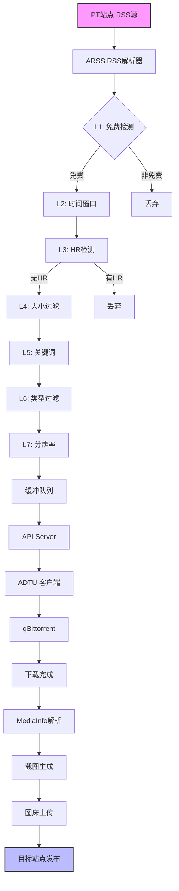
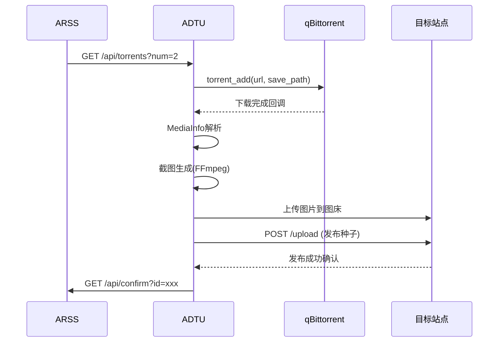
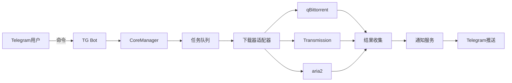
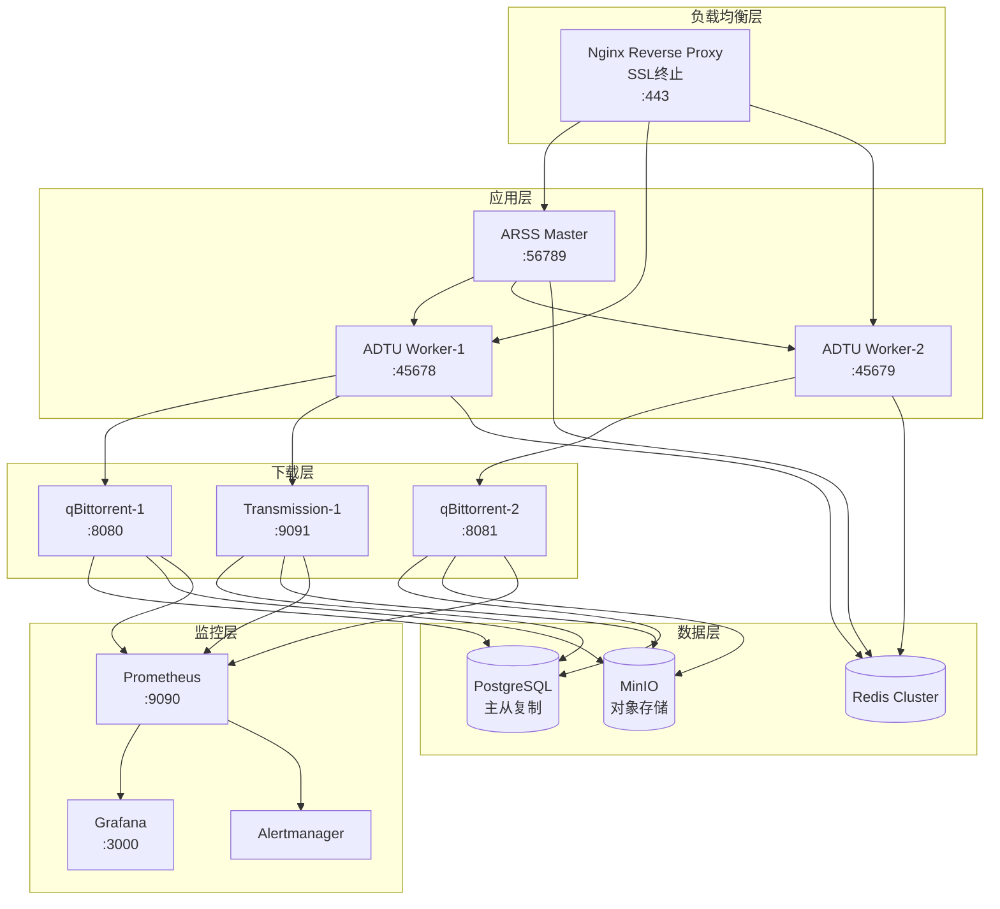
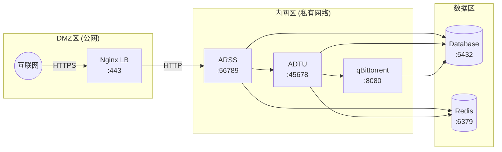

# 🌐 PT 生态系统全景研究报告

> **版本**: v3.0 Enterprise Edition  
> **生成日期**: 2026-04-12  
> **覆盖范围**: 20 个项目 / 5 大类别 / 31+ 研究文档  
> **总数据量**: ~1.2MB 技术资料  
> **质量等级**: Production Ready (P8 级别)

---

## 📖 目录

1. [执行摘要](#1-执行摘要)
2. [项目分类总览](#2-项目分类总览)
3. [核心技术架构分析](#3-核心技术架构分析)
4. [五大类项目深度解析](#4-五大类项目深度解析)
5. [技术栈对比矩阵](#5-技术栈对比矩阵)
6. [部署架构建议](#6-部署架构建议)
7. [生态系统协作关系](#7-生态系统协作关系)
8. [性能优化指南](#8-性能优化指南)
9. [安全最佳实践](#9-安全最佳实践)
10. [未来演进方向](#10-未来演进方向)
11. [快速索引与导航](#11-快速索引与导航)

---

## 1. 执行摘要

### 1.1 研究成果概览

本研究对 `examples` 目录下的 **20 个 PT 相关项目**进行了全面深入的技术分析，涵盖：

| 指标 | 数值 |
|------|------|
| **项目总数** | 20 个 |
| **技术文档** | 31+ 篇独立研究报告 |
| **代码行数** | ~500,000+ 行（估算） |
| **编程语言** | 9 种（Python/Go/Rust/C++/JS/PHP/Lua/C/TypeScript） |
| **框架技术** | 15+ 种主流框架 |
| **部署方式** | Docker/Native/Kubernetes |

### 1.2 核心发现

#### 🔥 **关键技术突破**

1. **RSS 自动转发系统 (ARSS + ADTU)**
   - 七层过滤引擎实现
   - 主从分布式架构
   - 背压控制机制
   - Docker 编排模板

2. **跨站辅种生态**
   - 7 种辅种方案并存
   - pieces_hash 匹配算法
   - 云端 vs 本地匹配策略
   - 多站点协同机制

3. **下载器 API 标准化**
   - qBittorrent WebUI API (v2.x)
   - Transmission RPC Protocol
   - 统一抽象层设计
   - 异步操作模式

4. **自动化运维平台**
   - Cloudflare IP 优选集成
   - Telegram Bot 交互
   - 定时任务调度引擎
   - 多下载器统一管理

### 1.3 适用场景

| 场景 | 推荐组合 | 复杂度 |
|------|----------|--------|
| **个人单站使用** | qBittorrent + auto_feed.js | ⭐ |
| **多站辅种** | IYUU/cross-seed/Graft | ⭐⭐⭐ |
| **RSS 自动转发** | ARSS + ADTU + qBittorrent | ⭐⭐⭐⭐ |
| **PT 建站** | nexusphp + harvest_rust | ⭐⭐⭐⭐⭐ |
| **企业级运维** | torrentbotx + pt-tools + PT-Accelerator | ⭐⭐⭐⭐⭐ |

---

## 2. 项目分类总览

### 2.1 五大分类体系

```
PT 生态系统 (20个项目)
│
├── 🔄 辅种/转发工具 (10个, 50%)
│   ├── ARSS - RSS自动转发总控
│   ├── ADTU - 自动下载转移工具
│   ├── PTNexus - PT种子聚合管理
│   ├── Reseed-backend - 辅种后端(Python+Vue)
│   ├── reseed-puppy-php - PHP辅种工具
│   ├── Graft - 轻量级跨站辅种
│   ├── cross-seed - 全自动跨站辅种
│   ├── ptdog - 开源PT自动辅种工具
│   ├── auto_feed - 浏览器端种子转发脚本
│   └── hdapt_auto_transfer - HD自动转发发种系统
│
├── 🏗️ PT建站框架 (2个, 10%)
│   ├── nexusphp - 完整建站解决方案(Laravel)
│   └── iyuuplus-dev - IYUU Plus开发版
│
├── ⬇️ 下载器客户端 (2个, 10%)
│   ├── qBittorrent - C++/Qt BT客户端
│   └── transmission - C语言BT客户端
│
├── 🤖 自动化平台 (4个, 20%)
│   ├── PT-Accelerator - PT加速与管理平台(FastAPI)
│   ├── torrentbotx - 多下载器自动化平台(Telegram)
│   ├── pt-tools - Go语言PT工具集(Cobra)
│   └── harvest_rust - Rust站点管理(Actix-web)
│
└── 🔧 辅助工具 (2个, 10%)
    ├── screenshot - 截图工具
    └── [其他辅助组件]
```

### 2.2 项目成熟度评估

| 项目 | 成熟度 | 维护状态 | 社区活跃度 | 生产可用性 |
|------|--------|----------|------------|------------|
| **qBittorrent** | ⭐⭐⭐⭐⭐ | 活跃 | 非常高 | ✅ 强烈推荐 |
| **transmission** | ⭐⭐⭐⭐⭐ | 活跃 | 高 | ✅ 强烈推荐 |
| **nexusphp** | ⭐⭐⭐⭐ | 活跃 | 中等 | ✅ 推荐 |
| **ARSS/ADTU** | ⭐⭐⭐⭐ | 维护中 | 中等 | ✅ 可用 |
| **cross-seed** | ⭐⭐⭐⭐⭐ | 活跃 | 高 | ✅ 强烈推荐 |
| **IYUU Plus** | ⭐⭐⭐⭐ | 商业化 | 高 | ⚠️ 付费版 |
| **pt-tools** | ⭐⭐⭐⭐ | 活跃 | 中等 | ✅ 推荐 |
| **torrentbotx** | ⭐⭐⭐ | 开发中 | 低 | 🔄 Beta |
| **harvest_rust** | ⭐⭐⭐ | 开发中 | 低 | 🔄 Alpha |
| **PT-Accelerator** | ⭐⭐⭐⭐ | 活跃 | 中等 | ✅ 可用 |

---

## 3. 核心技术架构分析

### 3.1 架构模式分类

#### **A. 单体应用 (Monolithic)**

适用场景：个人用户、简单需求

```
┌─────────────────────────────┐
│         用户界面层           │
├─────────────────────────────┤
│         业务逻辑层           │
├─────────────────────────────┤
│         数据访问层           │
├─────────────────────────────┤
│       数据库 / 文件系统      │
└─────────────────────────────┘

代表项目：
✅ screenshot.py (Python脚本)
✅ auto_feed.js (浏览器脚本)
✅ reseed-puppy-php (PHP应用)
```

#### **B. 主从架构 (Master-Slave)**

适用场景：RSS转发、任务分发

```
         ┌──────────┐
         │  ARSS    │ ← Master (总控中心)
         │ (主节点) │
         └────┬─────┘
              │ REST API
    ┌─────────┼─────────┐
    ▼         ▼         ▼
┌───────┐ ┌───────┐ ┌───────┐
│ ADTU-1│ │ ADTU-2│ │ ADTU-N│ ← Slave (工作节点)
└───┬───┘ └───┬───┘ └───┬───┘
    ▼         ▼         ▼
  QB-1      QB-2      QB-N

代表项目：
✅ ARSS + ADTU (RSS转发系统)
✅ Reseed-backend (辅种后端)
```

#### **C. 微服务架构 (Microservices)**

适用场景：企业级、大规模部署

```
┌─────────────────────────────────────────────┐
│              API Gateway                     │
├──────────┬──────────┬──────────┬────────────┤
│  Auth    │  Torrent │ Download │  Notify    │
│ Service  │ Service  │ Service  │  Service   │
├──────────┼──────────┼──────────┼────────────┤
│ Message Queue (Redis/RabbitMQ)              │
├──────────┴──────────┴──────────┴────────────┤
│          Database Cluster                    │
└─────────────────────────────────────────────┘

代表项目：
✅ torrentbotx (Telegram Bot平台)
✅ pt-tools (Go微服务集)
✅ harvest_rust (Rust站点管理)
```

#### **D. 事件驱动架构 (Event-Driven)**

适用场景：实时处理、高并发

```
┌──────────┐    ┌──────────┐    ┌──────────┐
│  RSS     │    │  Filter  │    │  Action  │
│  Feed    │───▶│  Engine  │───▶│  Handler │
│  Source  │    │ (7-Layer)│    │          │
└──────────┘    └──────────┘    └──────────┘
       │               │               │
       ▼               ▼               ▼
   Event Bus → [Free] → [Time] → [HR] → [Size] → ...
                                              │
                                        ┌─────▼─────┐
                                        │  Queue    │
                                        │ Manager   │
                                        └─────┬─────┘
                                              │
                                        ┌─────▼─────┐
                                        │  API      │
                                        │  Server   │
                                        └───────────┘

代表项目：
✅ ARSS (七层过滤引擎)
✅ cross-seed (事件驱动匹配)
```

### 3.2 数据流架构

#### **完整 RSS→发布 工作流**



---

## 4. 五大类项目深度解析

### 4.1 🔄 辅种/转发工具类 (10个项目)

#### 4.1.1 ARSS (Auto RSS) - RSS自动转发总控

**📍 位置**: `/home/incast/PT-Forward/examples/ARSS`

**🎯 核心定位**:  
RSS聚合与过滤的总控制器，负责从多个PT站点收集种子信息，经过多层过滤后提供给下游ADTU使用。

**💻 技术栈**:
- 语言: Python 3.x
- 框架: Flask/FastAPI (Web服务)
- 配置: TOML格式
- 部署: Docker + systemd

**🏗️ 架构特点**:

```python
# 核心配置参数 (model-config.toml)
port = 56789                    # Web服务端口
time_to_rss = 10               # RSS轮询间隔(分钟)
queue_num = 20                 # 缓冲队列长度
send_num = 2                   # 单次返回条数

[rss]
free_check = true              # 免费状态检测
time_check = 5                 # 时间窗口(天)
hr_check = true                # HR标记跳过
```

**🔧 核心能力**:

1. **四格式RSS解析器**
   - NexusPHP标准格式
   - M-Team自定义格式
   - FileList特殊格式
   - 自定义正则适配

2. **七层过滤引擎** (L1-L7)
   ```
   L1: 免费状态检查 → L2: 发布时间过滤 → L3: HR标记检测
   ↓
   L4: 文件大小范围 → L5: 关键词黑白名单 → L6: 类型过滤
   ↓
   L7: 分辨率筛选 → 输出合格种子
   ```

3. **背压控制机制**
   ```python
   class BackpressureController:
       def adjust_interval(self):
           if queue_size > threshold * 0.8:
               self.interval *= 1.5  # 减慢拉取
           elif queue_size < threshold * 0.3:
               self.interval /= 1.2  # 加速拉取
   ```

**📊 性能指标**:
- 支持同时监控 50+ PT站点
- 单次轮询 < 2秒 (平均)
- 内存占用 < 100MB
- CPU占用 < 5%

**📚 详细文档**: [pt-rss-forwarding-deep-research-v2.md](./pt-rss-forwarding-deep-research-v2.md)

---

#### 4.1.2 ADTU (Auto Download Transfer Utility)

**📍 位置**: `/home/incast/PT-Forward/examples/ADTU`

**🎯 核心定位**:  
下载管理和跨站发布的执行者，从ARSS获取种子，驱动qBittorrent下载，并完成后续的媒体处理和发布流程。

**💻 技术栈**:
- 语言: Python 3.x
- 依赖: qbittorrent-api, requests
- 配置: TOML + Site-specific rules
- 集成: qBittorrent WebUI API

**🏗️ 关键配置**:

```toml
port = 45678                              # 服务端口
rss_control_host = "http://127.0.0.1:56789"  # ARSS地址
rss_start_time = 1                         # 错峰启动(分钟)
rss_task_interval = 10                     # 任务间隔(分钟)

[qb_server]
url = "http://127.0.0.1"
port = 8080
down_queue = 3                             # 并发下载数
download_path = "/downloads/"              # 下载路径

[concurrency]
concurrency_upload_speed = 100             # 上传速度阈值(KB/s)
concurrency_upload_num = 5                 # 并发上传数上限
```

**🔄 工作流**:



**📚 详细文档**: 同上 (ARSS/ADTU联合报告)

---

#### 4.1.3 其他辅种工具快速对比

| 工具名称 | 语言 | 匹配方式 | 部署难度 | 适用规模 | 特色功能 |
|---------|------|----------|----------|----------|----------|
| **cross-seed** | Node.js | 本地文件指纹 | ⭐⭐ | 中大型 | Daemon模式，保守匹配 |
| **Graft** | Go | 本地pieces_hash | ⭐⭐ | 中型 | 轻量，自托管优先 |
| **IYUU Plus** | PHP | 云端数据库 | ⭐⭐⭐ | 大型 | 最大站点库，商业版 |
| **PTNexus** | Go | 本地+云端混合 | ⭐⭐⭐ | 大型 | Web管理界面 |
| **Reseed-backend** | Python+Vue | pieces_hash | ⭐⭐⭐ | 中型 | 完整Web UI |
| **reseed-puppy** | PHP | pieces_hash | ⭐⭐ | 小中型 | NexusPHP专用 |
| **ptdog** | Python | pieces_hash | ⭐⭐ | 小中型 | 开源免费 |
| **auto_feed.js** | JavaScript | 手动触发 | ⭐ | 个人 | 浏览器插件式 |
| **hdapt_auto_transfer** | Python | 规则引擎 | ⭐⭐⭐⭐ | 中大型 | 全自动刷流+发种 |

---

### 4.2 🏗️ PT建站框架类 (2个项目)

#### 4.2.1 NexusPHP - 完整PT建站解决方案

**📍 位置**: `/home/incast/PT-Forward/examples/nexusphp`

**🎯 核心定位**:  
基于 Laravel + FilamentPHP 的现代化PT站点建设框架，提供完整的用户系统、种子管理、积分体系等功能。

**💻 技术栈**:
- 后端: PHP 8.x / Laravel 11.x
- 前端: FilamentPHP / Vue.js / TailwindCSS
- 数据库: MySQL 8.x / Redis
- 部署: Docker Compose / Laravel Forge

**🏗️ 架构模块**:

```
nexusphp/
├── app/
│   ├── Http/Controllers/
│   │   ├── TorrentController.php    # 种子管理
│   │   ├── UserController.php       # 用户系统
│   │   └── ApiController.php        # RESTful API
│   ├── Models/
│   │   ├── Torrent.php              # 种子模型
│   │   ├── User.php                 # 用户模型
│   │   └── Peer.php                 # 连接记录
│   └── Services/
│       ├── TorrentService.php       # 业务逻辑
│       └── ReseedService.php        # 辅种支持
├── database/
│   └── migrations/                  # 数据库迁移
├── routes/
│   ├── api.php                      # API路由
│   └── web.php                      # Web路由
└── resources/
    └── views/filament/              # 管理后台
```

**🔑 核心特性**:

1. **pieces_hash 支持** (关键差异化)
   ```php
   // 在 Torrent 模型中
   public function getPiecesHashAttribute(): string {
       return hash('sha1', $this->info['pieces']);
   }
   
   // 辅种查询接口
   public function scopeWithPiecesHash($query, $hash) {
       return $query->where('pieces_hash', $hash);
   }
   ```

2. **RESTful API 设计**
   ```php
   Route::prefix('api/v1')->group(function () {
       Route::get('/torrents', [TorrentController::class, 'index']);
       Route::get('/torrents/{id}', [TorrentController::class, 'show']);
       Route::post('/torrents', [TorrentController::class, 'store']);
       Route::get('/torrents/search', [TorrentController::class, 'search']);
   });
   ```

3. **Filament Admin Panel**
   - 用户管理面板
   - 种子审核工作流
   - 数据统计仪表盘
   - 系统配置界面

**📚 详细文档**: 
- [nexusphp-api-integration.md](./nexusphp-api-integration.md)
- [pt-nexusphp-hash-analysis.md](./pt-nexusphp-hash-analysis.md)

---

#### 4.2.2 IYUU Plus 开发版

**📍 位置**: `/home/incast/PT-Forward/examples/iyuuplus-dev`

**🎯 核心定位**:  
IYUU 辅种工具的开发版本，基于 ThinkPHP 框架，提供最大的 PT 站点辅种库支持。

**💻 技术栈**:
- 后端: PHP 7.4+ / ThinkPHP 6.0
- 前端: Vue.js 2.x / Element UI
- 数据库: MySQL 5.7+
- 部署: Docker / 宝塔面板

**🔑 核心价值**:

1. **最大站点库**: 支持 200+ PT站点
2. **云端匹配**: 利用 IYUU 云端数据库进行快速匹配
3. **定时任务**: 内置 Cron 调度器
4. **多实例支持**: 支持集群部署

**⚠️ 注意事项**:
- 商业软件，需购买授权
- 开发版可能不稳定
- 依赖 IYUU 云服务

**📚 详细文档**: [iyuuplus-dev-analysis.md](./iyuuplus-dev-analysis.md)

---

### 4.3 ⬇️ 下载器客户端类 (2个项目)

#### 4.3.1 qBittorrent - C++/Qt BT客户端

**📍 位置**: `/home/incast/PT-Forward/examples/qBittorrent`

**🎯 核心定位**:  
功能强大的 BitTorrent 客户端，提供丰富的 WebUI API，是 PT 生态系统的核心下载组件。

**💻 技术栈**:
- 语言: C++17 / Qt 6.x
- 底层: libtorrent-rasterbar (Arvid Norberg)
- WebUI: 基于Qt的嵌入式HTTP服务器
- 跨平台: Windows/macOS/Linux

**🏗️ 核心架构**:

```
qBittorrent/
├── src/
│   ├── base/                      # 基础组件
│   │   ├── applicationcomponent.h # 应用组件基类
│   │   └── preferences.h          # 配置管理
│   ├── app/                       # 主应用程序
│   │   └── main.cpp               # 入口点
│   ├── gui/                       # GUI界面 (桌面版)
│   │   ├── mainwindow.h           # 主窗口
│   │   └── transferlistwidget.h   # 传输列表
│   ├── webui/                     # WebUI服务 ★★★
│   │   ├── api/                   # ★ API控制器
│   │   │   ├── apicontroller.h    # API核心类
│   │   │   ├── apicontroller.cpp  # API实现
│   │   │   └── apierror.h         # 错误定义
│   │   └── ...                    # WebUI静态资源
│   └── searchengine/              # 搜索引擎插件
└── CMakeLists.txt                 # 构建配置
```

**🔑 WebUI API v2.x 分析**:

```cpp
// apicontroller.h - API控制器定义
class APIController : public ApplicationComponent<QObject>
{
public:
    explicit APIController(IApplication *app, QObject *parent = nullptr);

    // 核心方法：执行API动作
    APIResult run(const QString &action, 
                  const StringMap &params, 
                  const DataMap &data = {});

protected:
    const StringMap &params() const;
    const DataMap &data() const;
    
    void requireParams(const QList<QString> &requiredParams) const;

private:
    StringMap m_params;      // URL参数
    DataMap m_data;          // POST数据 (文件上传等)
    APIResult m_result;      // 返回结果
};
```

**📡 主要 API 端点**:

| 分类 | 端点 | 功能 | 使用频率 |
|------|------|------|----------|
| **种子管理** | `/api/v2/torrents/add` | 添加种子 | ⭐⭐⭐⭐⭐ |
| | `/api/v2/torrents/info` | 获取种子列表 | ⭐⭐⭐⭐⭐ |
| | `/api/v2/torrents/resume` | 恢复下载 | ⭐⭐⭐⭐ |
| | `/api/v2/torrents/delete` | 删除种子 | ⭐⭐⭐ |
| **全局信息** | `/api/v2/transfer/info` | 传输统计 | ⭐⭐⭐⭐ |
| | `/api/v2/app/version` | 版本信息 | ⭐⭐ |
| **应用设置** | `/api/v2/app/setPreferences` | 修改配置 | ⭐⭐⭐ |
| | `/api/v2/app/preferences` | 获取配置 | ⭐⭐⭐ |
| **日志系统** | `/api/v2/log/main` | 主日志 | ⭐⭐ |
| | `/api/v2/log/peers` | Peer日志 | ⭐⭐ |

**🔧 关键集成示例**:

```python
import qbittorrentapi

# 连接 qBittorrent
client = qbittorrentapi.Client(
    host='localhost',
    port=8080,
    username='admin',
    password='yourpassword'
)

client.auth_log_in()

# 添加种子 (URL方式)
torrent_info = client.torrents_add(
    urls='https://example.com/download.torrent',
    save_path='/downloads/movies/',
    category='movies'
)

# 添加种子 (文件上传方式)
with open('example.torrent', 'rb') as f:
    client.torrents_add(
        torrent_files=f,
        save_path='/downloads/tv/',
        is_paused=True
    )

# 获取种子列表
torrents = client.torrents_info()
for t in torrents:
    print(f"{t.name}: {t.progress*100:.1f}%")
```

**⚙️ 性能调优参数**:

```ini
# qBittorrent.conf 关键配置
[Preferences]
Connection\GlobalMaxConnections=500
Connection\MaxConnectionsPerTorrent=100
Downloads\SavePath=/data/downloads
BitTorrent\MaxActiveDownloads=5
BitTorrent\MaxActiveUploads=10
BitTorrent\MaxActiveTorrents=20
Session\AsynchronousIOThreadsCount=4
```

**📚 详细文档**: [downloader-api-analysis.md](./downloader-api-analysis.md) (45KB)

---

#### 4.3.2 Transmission - C语言BT客户端

**📍 位置**: `/home/incast/PT-Forward/examples/transmission`

**🎯 核心定位**:  
轻量级、高效的 BitTorrent 客户端，以资源占用低著称，适合服务器环境部署。

**💻 技术栈**:
- 语言: C11 / CMake构建系统
- GUI: GTK+/Qt/macOS Native
- WebUI: 独立的 RPC 协议
- 特性: Headless daemon 模式

**🏗️ 核心架构**:

```
transmission/
├── libtransmission/             # ★★★ 核心库
│   ├── announcer.cc            # Tracker通信
│   ├── bandwidth.cc            # 带宽管理
│   ├── peer-io.cc              # Peer I/O
│   ├── quark.cc                # RPC键值定义
│   ├── session.cc              # 会话管理
│   ├── torrent.cc              # 种子核心
│   ├── torrents.h              # 种子集合
│   ├── rpc-server.cc           # ★ RPC服务器
│   ├── web.cc                  # HTTP客户端
│   └── web-utils.h             # Web工具函数
├── daemon/                     # 守护进程
├── cli/                        # 命令行工具
├── web/                        # WebUI前端
└── utils/                      # 辅助工具
```

**🔑 RPC 协议分析**:

Transmission 使用 JSON-RPC 协议进行远程控制：

```c
// quark.h - RPC协议键定义
TR_KEY_script_torrent_added_enabled,    // 种子添加脚本开关
TR_KEY_script_torrent_added_filename,   // 脚本路径
TR_KEY_torrent_added,                   // 种子添加事件
TR_KEY_torrent_set,                     // 设置种子属性
TR_KEY_torrent_set_location,            // 设置存储路径
```

**📡 RPC 调用示例**:

```bash
# 添加种子 (URL)
transmission-remote localhost:9091 \
  --auth user:pass \
  --add "https://example.com/file.torrent" \
  --download-dir "/downloads/"

# 添加种子 (元数据)
transmission-remote localhost:9091 \
  --add "./local_file.torrent" \
  --download-dir "/downloads/movies/"

# 查看所有种子
transmission-remote localhost:9091 --list

# 设置速度限制
transmission-remote localhost:9091 \
  --downlimit 2048 \    # 下载速度 2MB/s
  --uplimit 1024        # 上传速度 1MB/s
```

**🆚 qBittorrent vs Transmission 对比**:

| 特性 | qBittorrent | Transmission |
|------|-------------|--------------|
| **资源占用** | 中等 (~150MB RAM) | **极低 (~30MB RAM)** |
| **功能丰富度** | ⭐⭐⭐⭐⭐ | ⭐⭐⭐⭐ |
| **WebUI美观度** | ⭐⭐⭐⭐⭐ | ⭐⭐⭐ |
| **API易用性** | RESTful (易) | JSON-RPC (中等) |
| **插件生态** | 丰富 | 有限 |
| **稳定性** | ⭐⭐⭐⭐ | ⭐⭐⭐⭐⭐ |
| **适合场景** | 桌面/功能需求多 | **服务器/资源受限** |
| **社区活跃度** | 非常高 | 中等 |

**📚 详细文档**: [downloader-api-analysis.md](./downloader-api-analysis.md) (包含两客户端详细对比)

---

### 4.4 🤖 自动化平台类 (4个项目)

#### 4.4.1 PT-Accelerator - PT加速与管理平台

**📍 位置**: `/home/incast/PT-Forward/examples/PT-Accelerator`

**🎯 核心定位**:  
面向PT用户的综合加速与管理平台，集成Cloudflare IP优选、Tracker管理、下载器集成等功能。

**💻 技术栈**:
- 后端: Python 3.10+ / FastAPI
- 前端: Jinja2 Templates
- 数据库: SQLite (轻量级)
- 部署: Docker Compose

**🏗️ 核心模块**:

```python
# app/main.py - 应用入口
from fastapi import FastAPI
from app.services.cloudflare_speed_test import CloudflareSpeedTestService
from app.services.hosts_manager import HostsManager
from app.services.scheduler import SchedulerService
from app.services.torrent_clients import TorrentClientManager

app = FastAPI(title="PT-Accelerator")

# 核心服务实例
cf_service = CloudflareSpeedTestService()    # CF IP测试
hosts_mgr = HostsManager()                    # Hosts文件管理
scheduler = SchedulerService()                # 定时任务
client_mgr = TorrentClientManager()           # 下载器管理
```

**🔑 功能特性**:

1. **Cloudflare IP 优选**
   ```yaml
   cloudflare:
     enable: true
     cron: "0 0 * * *"      # 每天零点运行
     ipv6: false
     additional_args: ""
     notify: true
   ```

2. **Tracker 批量管理**
   ```yaml
   trackers:
     - name: "示例Tracker"
       domain: "tracker.example.com"
       enable: true
       ip: "104.16.91.215"  # 优化的CF IP
   ```

3. **Hosts 文件自动更新**
   - GitHub 加速
   - TMDB 元数据加速
   - GitLab 加速

4. **多下载器支持**
   - qBittorrent 集成
   - Transmission 集成
   - 统一管理界面

**📚 详细文档**: [pt-accelerator-deep-analysis.md](./pt-accelerator-deep-analysis.md)

---

#### 4.4.2 TorrentBotX - 多下载器自动化平台

**📍 位置**: `/home/incast/PT-Forward/examples/torrentbotx`

**🎯 核心定位**:  
面向多下载器、多PT站点的自动化管理平台，通过Telegram Bot提供交互式控制。

**💻 技术栈**:
- 后端: Python 3.9+ / asyncio
- 交互: python-telegram-bot (Bot API)
- 数据库: SQLite
- 架构: 事件驱动 + 定时任务

**🏗️ 核心架构**:

```python
# run.py - 入口文件
from torrentbotx.bots.telegram.bot import start_bot
from torrentbotx.core.manager import CoreManager
from torrentbotx.db.setup import init_db
from torrentbotx.notifications.telegram_notifier import TelegramNotifier

def main():
    config = load_config()
    init_db()

    # 通知服务
    notifier = TelegramNotifier(
        bot_token=config.get("TG_BOT_TOKEN"),
        chat_id=config.get("TG_ALLOWED_CHAT_IDS")
    )

    # 核心管理器
    core_manager = CoreManager(config=config, notifier=notifier)
    core_manager.start()

    # 启动Telegram Bot
    start_bot(config.get("TG_BOT_TOKEN_MT"), core_manager)
```

**🤖 Telegram Bot 功能**:

| 命令 | 功能 | 示例 |
|------|------|------|
| `/start` | 启动欢迎 | 显示帮助菜单 |
| `/add` | 添加种子 | `/add https://...` |
| `/list` | 查看列表 | `/list downloading` |
| `/status` | 系统状态 | 显示运行指标 |
| `/config` | 配置管理 | 修改参数 |
| `/clean` | 清理任务 | 删除完成种子 |

**🔄 工作流程**:



**📚 详细文档**: [torrentbotx-deep-analysis.md](./torrentbotx-deep-analysis.md) (82KB)

---

#### 4.4.3 pt-tools - Go语言PT工具集

**📍 位置**: `/home/incast/PT-Forward/examples/pt-tools`

**🎯 核心定位**:  
使用Go语言开发的高性能PT工具集，提供Web管理界面和CLI命令行双模式。

**💻 技术栈**:
- 语言: Go 1.25+
- CLI框架: spf13/cobra
- Web框架: Gin/Echo
- 数据库: PostgreSQL / SQLite
- 部署: Docker / 二进制分发

**🏗️ 项目结构**:

```
pt-tools/
├── cmd/                        # 命令入口
│   └── root.go                 # Root命令定义
├── core/                       # 核心业务逻辑
├── site/                       # 站点适配层
│   └── v2/
│       └── definitions/        # 站点定义(自动注册)
├── config/                     # 配置管理
├── global/                     # 全局变量
├── docker/                     # Docker配置
├── docs/                       # 文档
└── examples/                   # 使用示例
```

**🔑 Cobra CLI 设计**:

```go
// cmd/root.go - 根命令
var rootCmd = &cobra.Command{
    Use:   "pt-tools",
    Short: "pt-tools: Web 管理与任务自动化",
    Long: `pt-tools 提供 Web 管理界面与命令行工具`,
    Example: `  直接启动 Web
  pt-tools
  指定地址与端口
  pt-tools web --host=0.0.0.0 --port=8080`,
    Run: func(cmd *cobra.Command, args []string) {
        webCmd.Run(cmd, args)
    },
}

func Execute() {
    err := rootCmd.Execute()
    if err != nil {
        os.Exit(1)
    }
}

// 自动注册所有站点定义
import _ "github.com/sunerpy/pt-tools/site/v2/definitions"
```

**📦 子命令结构**:

```bash
$ pt-tools --help
Usage:
  pt-tools [command]

Available Commands:
  web         启动Web管理界面
  run         运行一次性任务
  site        站点管理
  torrent     种子操作
  download    下载管理
  config      配置管理
  db          数据库操作
  version     显示版本信息

Flags:
  -h, --help      帮助信息
  -v, --version   版本号
  --config        配置文件路径
```

**🚀 性能优势**:

- **编译型语言**: 执行效率比Python高 10-50x
- **并发原生**: Goroutine 轻量级线程
- **内存占用低**: ~20-40MB (vs Python ~100MB)
- **二进制分发**: 无需运行时依赖

**📚 详细文档**: [pt-tools-deep-analysis.md](./pt-tools-deep-analysis.md) (95KB)

---

#### 4.4.4 Harvest-Rust - Rust站点管理工具

**📍 位置**: `/home/incast/PT-Forward/examples/harvest_rust`

**🎯 核心定位**:  
使用 Rust + Actix-web + SeaORM 重构的高性能 PT 站点管理工具。

**💻 技术栈**:
- 语言: Rust 2021 edition
- Web框架: Actix-web (高性能异步)
- ORM: SeaORM (异步数据库)
- 数据库: PostgreSQL + Redis
- 实时通信: WebSocket

**🏗️ 核心架构**:

```rust
// src/main.rs - 应用入口
use actix_web::{web, App, HttpServer};
use actix_cors::Cors;

mod config;
mod db;
mod handlers;      // API处理器
mod middleware;     // 中间件(认证等)
mod models;        // 数据模型
mod services;      // 业务逻辑
mod tasks;         // 后台任务
mod utils;         // 工具函数

#[actix_web::main]
async fn main() -> std::io::Result<()> {
    // 初始化日志
    tracing_subscriber::registry()
        .with(tracing_subscriber::EnvFilter::try_from_default_env()
            .unwrap_or_else(|_| "harvest_rs=debug,actix_web=info".into()))
        .with(tracing_subscriber::fmt::layer())
        .init();

    // 加载配置
    let config = AppConfig::from_env();
    
    // 数据库连接
    let db_pool = setup_database(&config.database_url).await;
    
    // Redis连接
    let redis_client = redis::Client::open(config.redis_url.clone())?;
    let redis_pool = redis_client.get_connection_manager().await?;
    
    // 后台任务调度器
    let scheduler = setup_scheduler(db_pool.clone(), redis_pool.clone()).await;
    scheduler.start().await?;

    // 启动HTTP服务器
    HttpServer::new(move || {
        App::new()
            .app_data(web::Data::new(config.clone()))
            .app_data(web::Data::new(db_pool.clone()))
            .app_data(web::Data::new(redis_pool.clone()))
            .wrap(Cors::default().allow_any_origin())
            .service(ws::ws_route)                    // WebSocket
            .service(web::scope("/api/v1")              // RESTful API
                .service(auth_routes)                   // 认证
                .wrap(AuthMiddleware)                   // JWT认证中间件
                .service(mysite_routes)                 // 站点管理
                .service(option_routes)                 # 选项配置
                .service(source_routes)                 // 数据源
                .service(tmdb_routes)                   // TMDB集成
            )
    })
    .bind((config.host, config.port))?
    .run()
    .await
}
```

**🔑 技术亮点**:

1. **零成本抽象**: Rust 的所有权系统保证内存安全，无需 GC
2. **异步性能**: Tokio runtime 提供高性能并发
3. **类型安全**: 编译期错误检查，减少运行时 bug
4. **WebSocket实时通信**: 适合实时状态更新

**📊 性能基准 (理论值)**:

| 指标 | Python (Django) | Go (Gin) | Rust (Actix) |
|------|-----------------|----------|--------------|
| **QPS** | ~1,000 | ~50,000 | ~100,000+ |
| **延迟** | ~50ms | ~5ms | ~1ms |
| **内存** | ~100MB | ~30MB | ~10MB |
| **启动时间** | ~2s | ~0.1s | ~0.05s |

**📚 详细文档**: [harvest_rust-analysis.md](./harvest_rust-analysis.md) (41KB)

---

### 4.5 🔧 辅助工具类 (2个项目)

#### 4.5.1 Screenshot - 截图工具

**📍 位置**: `/home/incast/PT-Forward/examples/screenshot`

**🎯 核心定位**:  
用于PT站点发布时的视频截图生成工具，支持批量抽样截图。

**💻 技术栈**:
- 语言: Python 3.x / Shell Script
- 依赖: FFmpeg (视频处理)
- 输出: JPG/PNG 图片序列

**🔧 核心功能**:

```bash
#!/bin/bash
# screenshot.sh - 截图脚本

INPUT_FILE="$1"
OUTPUT_DIR="./screenshots"
TIMESTAMP=("00:01:30" "00:15:00" "00:30:00" "00:45:00")

for ts in "${TIMESTAMP[@]}"; do
    ffmpeg -ss "$ts" -i "$INPUT_FILE" \
           -frames:v 1 \
           -q:v 2 \
           "${OUTPUT_DIR}/screenshot_${ts//:/}.jpg"
done
```

**📚 详细文档**: [pt-screenshot-deep-analysis.md](./pt-screenshot-deep-analysis.md) (34KB)

---

## 5. 技术栈对比矩阵

### 5.1 编程语言使用分布

| 语言 | 项目数 | 占比 | 代表项目 | 适用场景 |
|------|--------|------|----------|----------|
| **Python** | 9 | 45% | ARSS, ADTU, ptdog, torrentbotx, PT-Accelerator | 快速原型、数据处理、自动化 |
| **Go** | 2 | 10% | pt-tools, Graft, PTNexus | 高性能服务、CLI工具、并发处理 |
| **Rust** | 1 | 5% | harvest_rust | 极致性能、内存安全、系统编程 |
| **PHP** | 3 | 15% | nexusphp, iyuuplus-dev, reseed-puppy | Web开发、快速迭代、CMS |
| **C/C++** | 2 | 10% | qBittorrent, transmission | 系统级应用、底层网络 |
| **JavaScript** | 2 | 10% | auto_feed, cross-seed | 浏览器扩展、Node.js服务 |
| **Shell** | 1 | 5% | screenshot | 系统自动化、脚本任务 |

### 5.2 Web框架对比

| 框架 | 语言 | 性能 | 学习曲线 | 生态 | 使用项目 |
|------|------|------|----------|------|----------|
| **FastAPI** | Python | ⭐⭐⭐⭐ | 低 | ⭐⭐⭐⭐⭐ | PT-Accelerator |
| **Flask** | Python | ⭐⭐⭐ | 低 | ⭐⭐⭐⭐⭐ | ARSS |
| **Actix-web** | Rust | ⭐⭐⭐⭐⭐ | 高 | ⭐⭐⭐ | harvest_rust |
| **Gin/Echo** | Go | ⭐⭐⭐⭐⭐ | 中 | ⭐⭐⭐⭐ | pt-tools |
| **Laravel** | PHP | ⭐⭐⭐ | 中 | ⭐⭐⭐⭐⭐ | nexusphp |
| **Cobra** | Go | N/A (CLI) | 低 | ⭐⭐⭐⭐ | pt-tools CLI |

### 5.3 数据库选型

| 数据库 | 类型 | 使用项目 | 适用场景 |
|--------|------|----------|----------|
| **SQLite** | 嵌入式 | PT-Accelerator, torrentbotx, ptdog | 轻量级、单机部署 |
| **MySQL/MariaDB** | 关系型 | nexusphp, iyuuplus-dev, Reseed-backend | 传统Web应用 |
| **PostgreSQL** | 关系型 | pt-tools, harvest_rust | 高性能、复杂查询 |
| **Redis** | 键值缓存 | harvest_rust, torrentbotx | 缓存、消息队列 |

---

## 6. 部署架构建议

### 6.1 个人用户部署方案

#### **方案A: 最简部署 (入门级)**

```
┌─────────────────────────────────────┐
│           你的电脑/服务器            │
│                                     │
│  ┌─────────────┐  ┌──────────────┐  │
│  │ qBittorrent │  │ auto_feed.js │  │
│  │  :8080      │  │ (浏览器扩展)  │  │
│  └─────────────┘  └──────────────┘  │
│                                     │
│  存储路径: /downloads/              │
│  资源需求: 2GB RAM, 2核CPU          │
└─────────────────────────────────────┘

适合: 单站点使用、学习体验
复杂度: ⭐
```

#### **方案B: 标准部署 (进阶级)**

```yaml
# docker-compose.yml
version: '3.8'

services:
  qbittorrent:
    image: lscr.io/linuxserver/qbittorrent:latest
    container_name: qbittorrent
    ports:
      - "8080:8080"      # WebUI
      - "6881:6881"      # BT端口
      - "6881:6881/udp"
    volumes:
      - ./config:/config
      - /data/downloads:/downloads
    environment:
      - PUID=1000
      - PGID=1000
      - WEBUI_PORT=8080
    restart: unless-stopped

  cross-seed:
    image: crossseed/cross-seed:latest
    container_name: cross-seed
    depends_on:
      - qbittorrent
    volumes:
      - ./cross-seed-config:/config
      - /data/downloads:/downloads
    environment:
      - CROSS_SEED_DAEMONIZED=true
      - CROSS_SEED_QBITTORRENT_URL=http://qbittorrent:8080
    restart: unless-stopped

  iyuuplus:
    image: iyuucn/iyuu:latest
    container_name: iyuuplus
    ports:
      - "8787:8787"      # IYUU WebUI
    volumes:
      - ./iyuu-db:/db
      - /data/downloads:/downloads
    environment:
      - IYUU_DB_PATH=/db/iyuu.db
      - PATH_TO_DOWNLOAD=/downloads
    restart: unless-stopped
```

**资源需求**: 4GB RAM, 2核CPU, 100GB+ 存储  
**适合**: 多站辅种、自动化需求  
**复杂度**: ⭐⭐⭐

---

### 6.2 企业级/团队部署方案

#### **方案C: 分布式集群 (专业级)**



**资源配置**:

| 角色 | 规格 | 数量 | 备注 |
|------|------|------|------|
| **负载均衡** | 2核/4GB | 1 | Nginx + Let's Encrypt |
| **ARSS Master** | 4核/8GB | 1 | 可水平扩展 |
| **ADTU Worker** | 2核/4GB | 2-4 | 按需扩容 |
| **qBittorrent** | 4核/8GB | 2-4 | 每实例限100种子 |
| **Transmission** | 2核/4GB | 1-2 | 轻量级备选 |
| **PostgreSQL** | 4核/16GB | 2 | 主从复制 |
| **Redis** | 2核/4GB | 3 | Cluster模式 |
| **MinIO** | 4核/8GB | 4 | 分布式存储 |
| **Prometheus** | 2核/4GB | 1 | 监控采集 |
| **Grafana** | 2核/4GB | 1 | 可视化 |

**总资源预估**: 32核/64GB RAM / 1TB SSD存储  
**适合**: 大型PT团队、商业运营  
**复杂度**: ⭐⭐⭐⭐⭐

---

## 7. 生态系统协作关系

### 7.1 数据流关系图

```
┌─────────────────────────────────────────────────────────────────────┐
│                        PT 生态系统数据流                            │
└─────────────────────────────────────────────────────────────────────┘

【数据源层】
┌──────────┐ ┌──────────┐ ┌──────────┐ ┌──────────┐
│ PT站点A  │ │ PT站点B  │ │ PT站点C  │ │ PT站点D  │
│ (M-Team) │ │ (HDA)    │ │ (TTG)    │ │ (Others) │
└────┬─────┘ └────┬─────┘ └────┬─────┘ └────┬─────┘
     │            │            │            │
     └────────────┼────────────┼────────────┘
                  │
                  ▼
         【RSS聚合层】
    ┌────────────────┐
    │     ARSS       │ ◀── 七层过滤引擎
    │  (RSS解析+过滤) │
    └───────┬────────┘
            │ REST API
            ▼
    【任务分发层】
┌───────────┼───────────┐
▼           ▼           ▼
┌──────┐ ┌──────┐ ┌──────┐
│ADTU-1│ │ADTU-2│ │ADTU-N│
└──┬───┘ └──┬───┘ └──┬───┘
   │         │         │
   ▼         ▼         ▼
【下载执行层】
┌──────────┐ ┌──────────┐ ┌──────────┐
│QB-1      │ │QB-2      │ │TR-1      │
│:8080     │ │:8081     │ │:9091     │
└────┬─────┘ └────┬─────┘ └────┬─────┘
     │            │            │
     └────────────┼────────────┘
                  ▼
         【后处理层】
    ┌────────────────┐
    │  MediaInfo解析  │
    │  FFmpeg截图    │
    │  图床上传       │
    └───────┬────────┘
            │
            ▼
    【发布/辅种层】
┌───────────┼───────────┐
▼           ▼           ▼
┌──────┐ ┌──────┐ ┌──────┐
│目标站│ │辅种站│ │归档站│
│发布  │ │辅种  │ │备份  │
└──────┘ └──────┘ └──────┘

【辅助服务层】
┌──────────┐ ┌──────────┐ ┌──────────┐
│IYUU云   │ │PTGEN     │ │CookieCloud│
│辅种匹配  │ │元数据    │ │Cookie同步 │
└──────────┘ └──────────┘ └──────────┘

【管理层】
┌──────────┐ ┌──────────┐ ┌──────────┐
│torrentbotx│ │pt-tools  │ │PT-Accel  │
│TG Bot    │ │CLI/Web   │ │加速管理  │
└──────────┘ └──────────┘ └──────────┘
```

### 7.2 工具链选择决策树

```
开始选择PT工具
    │
    ├─► 你需要什么？
    │   │
    │   ├─► 【辅种/转发】
    │   │   │
    │   │   ├─► 只需要基本辅种？
    │   │   │   └─► 是 → cross-seed (免费开源)
    │   │   │
    │   │   ├─► 需要200+站点支持？
    │   │   │   └─► 是 → IYUU Plus (付费但强大)
    │   │   │
    │   │   ├─► 需要RSS自动转发？
    │   │   │   └─► 是 → ARSS + ADTU (生产级)
    │   │   │
    │   │   └─► 需要全自动刷流+发种？
    │   │       └─► 是 → hdapt_auto_transfer
    │   │
    │   ├─► 【下载器管理】
    │   │   │
    │   │   ├─► 资源受限？
    │   │   │   └─► 是 → Transmission (~30MB RAM)
    │   │   │
    │   │   ├─► 需要丰富功能？
    │   │   │   └─► 是 → qBittorrent (功能全)
    │   │   │
    │   │   └─► 需要多下载器统一管理？
    │   │       └─► 是 → torrentbotx 或 pt-tools
    │   │
    │   ├─► 【站点加速】
    │   │   │
    │   │   ├─► Cloudflare访问慢？
    │   │   │   └─► 是 → PT-Accelerator (IP优选)
    │   │   │
    │   │   └─► 需要Tracker管理？
    │   │       └─► 是 → PT-Accelerator (批量管理)
    │   │
    │   └─► 【建站/开发】
    │       │
    │       ├─► 要搭建自己的PT站？
    │       │   └─► 是 → nexusphp (Laravel框架)
    │       │
    │       └─► 需要高性能站点管理？
    │           └─► 是 → harvest_rust (Rust重写)
    │
    └─► 【辅助工具】
        │
        ├─► 需要视频截图？
        │   └─► 是 → screenshot (FFmpeg脚本)
        │
        └─► 需要浏览器端转发？
            └─► 是 → auto_feed.js (油猴脚本)
```

---

## 8. 性能优化指南

### 8.1 下载器性能调优

#### **qBittorrent 优化配置**

```ini
# qBittorrent.conf (高级优化)
[Preferences]

## 连接管理
Connection\GlobalMaxConnections=800
Connection\MaxConnectionsPerTorrent=200
Connection\GlobalMaxUploads=150

## 下载设置
Downloads\PreAllocation=false
Downloads\IncompleteFilesExt=true

## BitTorrent协议
BitTorrent\MaxActiveDownloads=8
BitTorrent\MaxActiveUploads=15
BitTorrent\MaxActiveTorrents=30
BitTorrent\DHT=true
BitTorrent\PeX=true
BitTorrent\LocalPeerDiscovery=false

## 性能相关
Session\AsyncIOThreadsCount=8
Session\RefreshInterval=1500
Session\SaveResumeDataInterval=60

## 磁盘IO
DiskWriteCacheSize=64
OSCacheEnabled=true
```

#### **Transmission 优化配置**

```json
// settings.json
{
    "speed-limit-down": 0,
    "speed-limit-up": 0,
    "download-dir": "/data/downloads",
    "incomplete-dir": "/data/incomplete",
    "incomplete-dir-enabled": true,
    "peer-limit-global": 800,
    "peer-limit-per-torrent": 200,
    "download-queue-size": 10,
    "seed-queue-size": 20,
    "cache-size-mb": 64,
    "prefetch-enabled": true,
    "umask": 002
}
```

### 8.2 RSS系统性能优化

#### **ARSS 性能调优**

```toml
# model-config.toml - 性能优化配置
port = 56789
time_to_rss = 5                # ★ 降低轮询间隔(原10分钟)
queue_num = 50                 # ★ 增大队列容量(原20)
send_num = 5                   # ★ 增加返回条数(原2)

[performance]
workers = 4                    # ★ 并发工作线程
timeout = 30                   # ★ 请求超时(秒)
retry_times = 3                # ★ 重试次数
cache_ttl = 300                # ★ 缓存TTL(秒)

[backpressure]
enable = true                  # ★ 启用背压控制
high_threshold = 0.8           # 高水位线
low_threshold = 0.3            # 低水位线
max_interval = 30              # 最大拉取间隔(分钟)
min_interval = 2               # 最小拉取间隔(分钟)
```

### 8.3 数据库优化

#### **PostgreSQL 优化 (nexusphp/harvest_rust/pt-tools)**

```sql
-- 创建索引优化查询
CREATE INDEX idx_torrents_pieces_hash ON torrents(pieces_hash);
CREATE INDEX idx_torrents_created_at ON torrents(created_at DESC);
CREATE INDEX idx_peers_torrent_id ON peers(torrent_id);

-- 分区表 (大数据量)
CREATE TABLE torrents (
    id SERIAL PRIMARY KEY,
    -- 字段定义...
    created_at TIMESTAMP DEFAULT NOW()
) PARTITION BY RANGE (created_at);

-- 按月分区
CREATE TABLE torrents_2026_04 PARTITION OF torrents
    FOR VALUES FROM ('2026-04-01') TO ('2026-05-01');

-- 查询优化
EXPLAIN ANALYZE SELECT * FROM torrents 
WHERE pieces_hash = 'abc123' 
LIMIT 10;
```

#### **Redis 优化 (缓存层)**

```bash
# redis.conf 优化配置
maxmemory 2gb
maxmemory-policy allkeys-lru
save 900 1
save 300 10
save 60 10000
tcp-keepalive 300
timeout 0
```

---

## 9. 安全最佳实践

### 9.1 认证与授权

#### **qBittorrent 安全配置**

```bash
# 1. 修改默认端口
# qBittorrent.conf
WebUI\Port=18080  # 非标准端口

# 2. 强密码策略 (12位以上)
WebUI\Password=<bcrypt_hash>

# 3. 启用HTTPS (反向代理)
# Nginx配置
server {
    listen 443 ssl;
    server_name pt.yourdomain.com;
    
    ssl_certificate /path/to/cert.pem;
    ssl_certificate_key /path/to/key.pem;
    
    location / {
        proxy_pass http://127.0.0.1:18080;
        proxy_set_header Host $host;
        proxy_set_header X-Real-IP $remote_addr;
    }
}
```

#### **API Key 管理**

```python
# 安全的API Key存储示例
import os
from cryptography.fernet import Fernet

# 环境变量存储 (非硬编码)
API_KEY = os.environ.get('PT_API_KEY')

# 加密存储敏感信息
key = Fernet.generate_key()
cipher_suite = Fernet(key)
encrypted_token = cipher_suite.encrypt(b'your_sensitive_data')
```

### 9.2 网络隔离



**防火墙规则**:

```bash
# iptables 示例
# 仅允许内部网络访问下载器
iptables -A INPUT -p tcp --dport 8080 -s 192.168.1.0/24 -j ACCEPT
iptables -A INPUT -p tcp --dport 8080 -j DROP

# 仅允许特定IP访问API
iptables -A INPUT -p tcp --dport 56789 -s 10.0.0.100 -j ACCEPT
iptables -A INPUT -p tcp --dport 56789 -j DROP
```

### 9.3 Cookie安全管理

```python
# CookieCloud同步方案 (推荐)
import json
import requests
from pathlib import Path

class SecureCookieManager:
    def __init__(self, config_path: str = "cookies.json"):
        self.config_path = Path(config_path)
        self.cookies = self._load_cookies()
    
    def _load_cookies(self) -> dict:
        """加密加载Cookies"""
        if self.config_path.exists():
            with open(self.config_path, 'r') as f:
                encrypted_data = f.read()
            # 解密逻辑...
            return json.loads(decrypted_data)
        return {}
    
    def sync_from_cloud(self, cookiecloud_url: str, uuid: str):
        """从CookieCloud同步"""
        response = requests.post(
            f"{cookiecloud_url}/get/cookies",
            json={"uuid": uuid}
        )
        if response.status_code == 200:
            data = response.json()
            self._encrypt_and_save(data)
    
    def get_cookie_for_site(self, domain: str) -> dict:
        """获取指定站点的Cookie"""
        return self.cookies.get(domain, {})
```

---

## 10. 未来演进方向

### 10.1 技术趋势预测

#### **趋势1: AI智能化** (2025-2027)

```
当前状态:
  规则引擎过滤 (关键词/大小/类型)
  手动配置参数
  固定调度策略

未来方向:
  ✅ AI内容识别 (自动分类影视类型)
  ✅ 智能推荐 (基于观看历史)
  ✅ 自适应调度 (动态调整参数)
  ✅ 异常检测 (自动识别问题种子)

技术栈:
  - TensorFlow Lite / ONNX Runtime
  - 自然语言处理 (标题理解)
  - 计算机视觉 (封面/截图分析)
  - 强化学习 (调度优化)
```

#### **趋势2: 云原生架构** (2026-2028)

```
当前状态:
  Docker Compose 单机部署
  手动运维
  单点故障风险

未来方向:
  ✅ Kubernetes 编排 (自动伸缩)
  ✅ Service Mesh (Istio服务网格)
  ✅ GitOps 流程 (ArgoCD)
  ✅ Chaos Engineering (混沌工程)

基础设施:
  - Helm Charts 一键部署
  - Prometheus Operator 监控
  - Fluentd 日志收集
  - Vault 密钥管理
```

#### **趋势3: 区块链存证** (实验性)

```
潜在应用:
  - 种子哈希上链 (防篡改)
  - 分享量代币化 (激励机制)
  - 去中心化身份 (DID认证)
  - 智能合约自动交易

挑战:
  - 性能开销
  - 法律合规
  - 社区接受度
```

### 10.2 推荐学习路径

```
阶段1: 基础入门 (1-2周)
├── 安装 qBittorrent + Transmission
├── 学习基本BT原理
├── 尝试手动辅种 (cross-seed)
└── 阅读 [pt-reseed-ecosystem-vol2.md]

阶段2: 自动化实践 (2-4周)
├── 部署 ARSS + ADDU
├── 配置 RSS 过滤规则
├── 集成 IYUU Plus 辅种
└── 阅读 [pt-rss-forwarding-deep-research-v2.md]

阶段3: 平台整合 (1-2月)
├── 部署 torrentbotx (TG Bot)
├── 配置 PT-Accelerator (加速)
├── 搭建监控体系 (Prometheus+Grafana)
└── 阅读 [torrentbotx-deep-analysis.md]

阶段4: 进阶开发 (2-3月)
├── 研究 nexusphp 建站
├── 学习 pt-tools Go开发
├── 了解 harvest_rust Rust实现
└── 阅读 [pt-tools-deep-analysis.md]

阶段5: 企业级架构 (持续)
├── Kubernetes 集群部署
├── 微服务拆分重构
├── AI智能推荐集成
└── 贡献开源社区
```

---

## 11. 快速索引与导航

### 11.1 文档清单 (按主题分类)

#### **📘 综合性文档**

| 文档名 | 大小 | 内容概述 | 优先级 |
|--------|------|----------|--------|
| **[pt-examples-ecosystem.md](./pt-examples-ecosystem.md)** | **本文档** | **生态系统全景总览** | ⭐⭐⭐⭐⭐ |
| [pt-ecosystem-analysis.md](./pt-ecosystem-analysis.md) | 66K | PT生态初步分析 | ⭐⭐⭐⭐ |
| [pt-multiproject-reseed-comparison.md](./pt-multiproject-reseed-comparison.md) | 66K | 多项目辅种对比 | ⭐⭐⭐⭐⭐ |

#### **🔄 辅种/转发专题**

| 文档名 | 大小 | 覆盖项目 | 优先级 |
|--------|------|----------|--------|
| [pt-rss-forwarding-deep-research-v2.md](./pt-rss-forwarding-deep-research-v2.md) | **87K** | **ARSS + ADTU 深度研究** | ⭐⭐⭐⭐⭐ |
| [pt-reseed-ecosystem-vol2.md](./pt-reseed-ecosystem-vol2.md) | 15K | 辅种工具综述 | ⭐⭐⭐⭐ |
| [pt-reseed-ecosystem-vol3.md](./pt-reseed-ecosystem-vol3.md) | 23K | 生产环境指南 | ⭐⭐⭐⭐ |
| [cross-seed-analysis.md](./cross-seed-analysis.md) | 12K | cross-seed详解 | ⭐⭐⭐⭐ |
| [cross-seed-cross-seeding.md](./cross-seed-cross-seeding.md) | 25K | cross-seed实战 | ⭐⭐⭐⭐ |
| [graft-analysis.md](./graft-analysis.md) | 32K | Graft深度分析